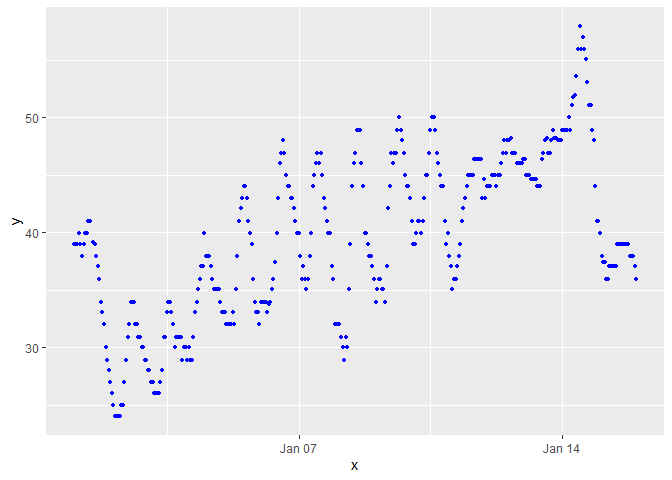

p8105_hw1_mgw2144
================
2023-09-19

install.packages(“moderndive”) performed in console

``` r
library(moderndive)
library(tidyverse)
```

    ## ── Attaching core tidyverse packages ──────────────────────── tidyverse 2.0.0 ──
    ## ✔ dplyr     1.1.3     ✔ readr     2.1.4
    ## ✔ forcats   1.0.0     ✔ stringr   1.5.0
    ## ✔ ggplot2   3.4.3     ✔ tibble    3.2.1
    ## ✔ lubridate 1.9.2     ✔ tidyr     1.3.0
    ## ✔ purrr     1.0.2     
    ## ── Conflicts ────────────────────────────────────────── tidyverse_conflicts() ──
    ## ✖ dplyr::filter() masks stats::filter()
    ## ✖ dplyr::lag()    masks stats::lag()
    ## ℹ Use the conflicted package (<http://conflicted.r-lib.org/>) to force all conflicts to become errors

``` r
data("early_january_weather")
```

``` r
help("early_january_weather")
```

    ## starting httpd help server ... done

The dataset “early_january_weather” has 15 variables: \* origin (weather
station) \* year, month, day, hour (time of recording) \* temp, dewp
(temperature and dewpoint in F) \* humid (relative humidity) \*
wind_dir, wind_speed, wind_gust (wind direction (in degrees), speed and
gust speed (in mph)) \* precip (precipitation in inches) \* pressure
(sea level pressure in millibars) \* visib (visibility in miles) \*
time_hour (date and hour of the recording)

``` r
nrow(early_january_weather)
```

    ## [1] 358

``` r
ncol(early_january_weather)
```

    ## [1] 15

There are 358 rows and 15 columns in the dataset as assessed trough the
nrow and ncol function.

``` r
mean(early_january_weather[["temp"]])
```

    ## [1] 39.58212

The mean temperature in the dataset is 39.58 degrees fahrenheit.

Write a short description of the dataset using inline R code; accessing
the dataset help file can be informative. In your discussion, please
include:

the variables in this dataset, including names / values of important
variables

``` r
early_january_weather_2=
  tibble(
    x = early_january_weather[["time_hour"]],
    y = early_january_weather[["temp"]],
    z = early_january_weather[["humid"]]
  )
```

``` r
ggplot(early_january_weather_2, aes(x = x, y = y)) + 
  geom_point(
    mapping = aes(x = x, y = y), data = early_january_weather_2, colour = 'blue', size = 1
  )
```

<!-- -->
The plot shows an increasing trend in temperature overall over the the
course of the two week period. The temperature cycles up and down with
the hours following the day and night cycles. There appears to be a cold
period in the days approaching January 14th where the highs of the
temperatures are lower and there is less spread between the highs and
lows in the temperature points for the day.

``` r
ggsave("scatterplot_hw1.pdf")
```

    ## Saving 7 x 5 in image
